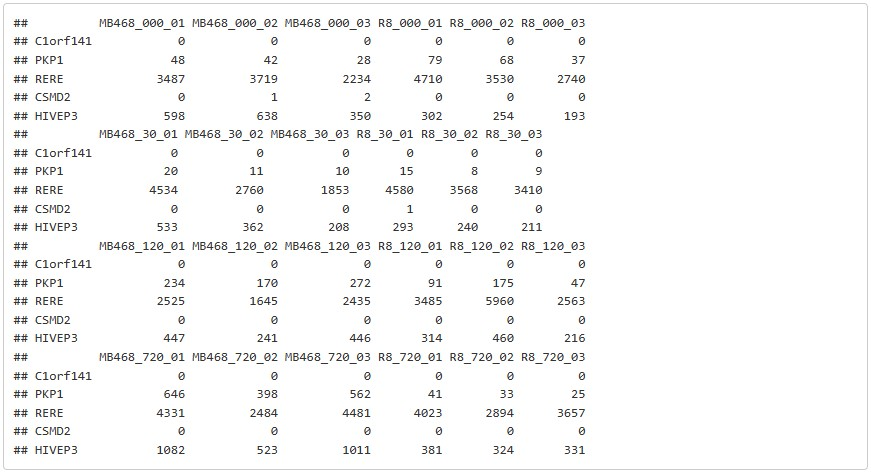
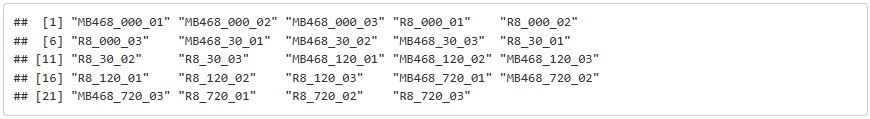
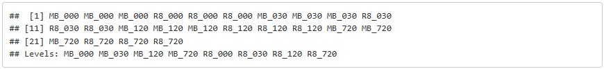
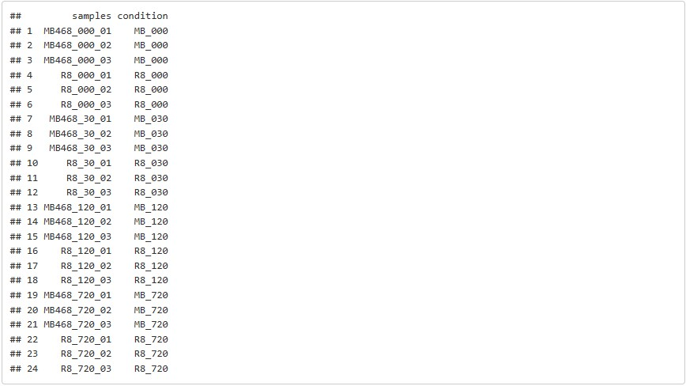
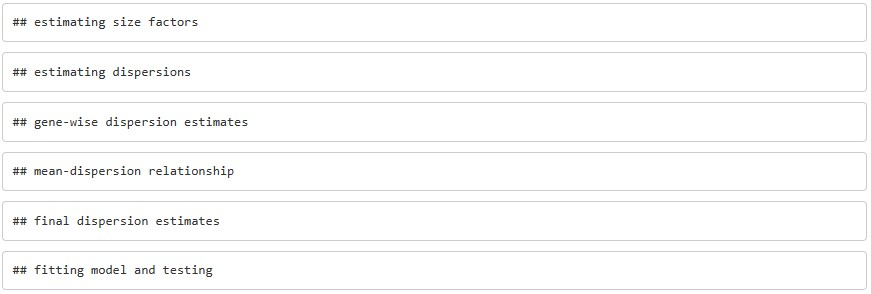
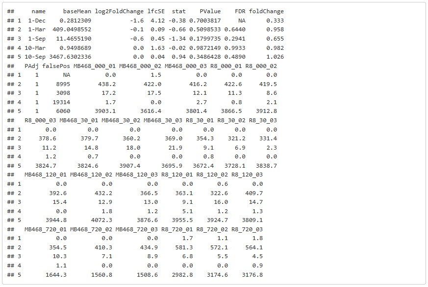

# [Franco](https://github.com/altsplicer) / [***DEseq2***](https://github.com/altsplicer)

[](#nolink)

## Overview

This a walk-through of the DEseq2 script used for Met Cancer project in the Hertel and Kaiser lab. DEseq2 is a R package from Bioconductor used in the task of analyzing read count data from RNA-seq in the detection of differential expressed genes. The is done by the use of negative binomial generalized linear models; the estimates of dispersion and logarithmic fold changes incorporate data-driven prior distributions. See the following link for a general [DEseq2](https://lashlock.github.io/compbio/R_presentation.html) tutorial from the creators in the Love lab. You can also see this walk-through via this [link](https://altsplicer.github.io/Methionine-AltSplicing/DESEQ2_RMD.html).

## Install and Load DEseq2 in R studio

``` r
# installion of DESEQ2 via Biocmanager
BiocManager::install("DESeq2")

# Load required packages
library(DESeq2)
```

## Locate your reads count file

The input file will be a the output text file from the STAR aligner, geneCounts or a feature counts text file.

``` r
# location of read counts text file
# infile = "./example.txt"
infile = "./com_0v30v120v720counts.txt"
```

## Setup the experimental design

This will set up the experimental design that will be used to run the DEseq2 analysis. In this case we have 3 reps per condition and 8 conditions. 2 cells lines under 4 media conditions.

``` r
# design for 3 reps, 8 conditions
design = c( "3", "3", "3", "3", "3", "3", "3", "3")
# design for 2 reps 4 conditions
# design = c( "2", "2", "2", "2")

# call the design and transform them into a integer character.
reps1 = as.integer(design[1])
reps2 = as.integer(design[2])
reps3 = as.integer(design[3])
reps4 = as.integer(design[4])
reps5 = as.integer(design[5])
reps6 = as.integer(design[6])
reps7 = as.integer(design[7])
reps8 = as.integer(design[8])

# Set up the conditions based on the experimental setup.
# cond1 = rep("cond1", reps1)
# cond2 = rep("cond2", reps2)

cond1 = rep("MB_000", reps1)
cond2 = rep("R8_000", reps2)
cond3 = rep("MB_030", reps3)
cond4 = rep("R8_030", reps4)
cond5 = rep("MB_120", reps5)
cond6 = rep("R8_120", reps6)
cond7 = rep("MB_720", reps7)
cond8 = rep("R8_720", reps8)
```

# Read the data from the standard input.

``` r
counts = read.table(infile, header=TRUE, sep="\t", row.names=1 )

# Optional, head the counts to view the formatting and adjust accordingly
#head(counts, 5)
```

# Edit the counts matrix

The count data so the only the read counts and gene name remains.

``` r
# Assume the last columns are the count matrix.
#idx = ncol(counts) - (reps1 + reps2)
idx = ncol(counts) - (reps1 + reps2 + reps3 + reps4 + reps5 + reps6 + reps7 + reps8)

# Cut out the valid columns.
# counts = counts[-c(1:idx)]
counts = counts[-c(1:idx)]

# Some tools generate the estimated counts as real numbers
# DESeq 2 allows only integers. We need to convert real numbers to rounded integers.
numeric_idx = sapply(counts, mode) == 'numeric'
counts[numeric_idx] = round(counts[numeric_idx], 0)
head(counts, 5)
```

[](#nolink)


# Build the data set names and conditions

``` r
samples = names(counts)
condition = factor(c(cond1, cond2, cond3, cond4, cond5, cond6, cond7, cond8))
colData = data.frame(samples=samples, condition=condition)

# You can view the dataset by calling the following
samples
condition
colData
```

[](#nolink)
[](#nolink)
[](#nolink)


# Create DESEq2 data set.

``` r
#dds = DESeqDataSetFromMatrix(countData=counts, colData=colData, design = ~condition)
dds = DESeqDataSetFromMatrix(countData=counts, colData=colData, design = ~condition)
```

[](#nolink)

# Run DEseq2.

``` r
dds = DESeq(dds)
```

[](#nolink)

# Extract the DESeq2 result.

Extract the result for each differential expression analysis between two conditions.

``` r
# res = results(dds)
res1 = results(dds, contrast = c("condition", "R8_000", "MB_000"))
res2 = results(dds, contrast = c("condition", "MB_030", "MB_000"))
res3 = results(dds, contrast = c("condition", "MB_120", "MB_000"))
res4 = results(dds, contrast = c("condition", "MB_720", "MB_000"))
res5 = results(dds, contrast = c("condition", "R8_030", "R8_000"))
res6 = results(dds, contrast = c("condition", "R8_120", "R8_000"))
res7 = results(dds, contrast = c("condition", "R8_720", "R8_000"))
```

# Turn the DESeq2 results into data frames.

``` r
# data = data.frame(res)
data1 = data.frame(res1)
data2 = data.frame(res2)
data3 = data.frame(res3)
data4 = data.frame(res4)
data5 = data.frame(res5)
data6 = data.frame(res6)
data7 = data.frame(res7)
```

# Edit the data frames to add Log Fold Change, FDR, and round numbers

``` r
# Rename columns for what they are.
# names(data)[names(data)=="pvalue"] <-"PValue"
# names(data)[names(data)=="padj"] <-"FDR"
names(data1)[names(data1)=="pvalue"] <-"PValue"
names(data1)[names(data1)=="padj"] <-"FDR"

names(data2)[names(data2)=="pvalue"] <-"PValue"
names(data2)[names(data2)=="padj"] <-"FDR"

names(data3)[names(data3)=="pvalue"] <-"PValue"
names(data3)[names(data3)=="padj"] <-"FDR"

names(data4)[names(data4)=="pvalue"] <-"PValue"
names(data4)[names(data4)=="padj"] <-"FDR"

names(data5)[names(data5)=="pvalue"] <-"PValue"
names(data5)[names(data5)=="padj"] <-"FDR"

names(data6)[names(data6)=="pvalue"] <-"PValue"
names(data6)[names(data6)=="padj"] <-"FDR"


# Create the additional columns.
# data$foldChange = 2 ^ data$log2FoldChange
# data$PAdj = p.adjust(data$PValue, method="hochberg")


data1$foldChange = 2 ^ data1$log2FoldChange
data1$PAdj = p.adjust(data1$PValue, method="hochberg")


data2$foldChange = 2 ^ data2$log2FoldChange
data2$PAdj = p.adjust(data2$PValue, method="hochberg")


data3$foldChange = 2 ^ data3$log2FoldChange
data3$PAdj = p.adjust(data3$PValue, method="hochberg")


data4$foldChange = 2 ^ data4$log2FoldChange
data4$PAdj = p.adjust(data4$PValue, method="hochberg")


data5$foldChange = 2 ^ data5$log2FoldChange
data5$PAdj = p.adjust(data5$PValue, method="hochberg")

data6$foldChange = 2 ^ data6$log2FoldChange
data6$PAdj = p.adjust(data6$PValue, method="hochberg")

# Sort the data by PValue to compute false discovery counts.
#data = data[with(data, order(PValue, -foldChange)), ]
data1 = data1[with(data1, order(PValue, -foldChange)), ]

data2 = data2[with(data2, order(PValue, -foldChange)), ]

data3 = data3[with(data3, order(PValue, -foldChange)), ]

data4 = data4[with(data4, order(PValue, -foldChange)), ]
 
data5 = data5[with(data5, order(PValue, -foldChange)), ]

data6 = data6[with(data6, order(PValue, -foldChange)), ]

# Compute the false discovery counts on the sorted table.
#data$falsePos = 1:nrow(data) * data$FDR
data1$falsePos = 1:nrow(data1) * data1$FDR

data2$falsePos = 1:nrow(data2) * data2$FDR

data3$falsePos = 1:nrow(data3) * data3$FDR

data4$falsePos = 1:nrow(data4) * data4$FDR

data5$falsePos = 1:nrow(data5) * data5$FDR

data6$falsePos = 1:nrow(data6) * data6$FDR


# Get the normalized counts.
normed = counts(dds, normalized=TRUE)

# Round normalized counts to a single digit.
normed = round(normed, 1)

# Merge the two datasets by row names.
#total <- merge(data, normed, by=0)
total1 <- merge(data1, normed, by=0)

total2 <- merge(data2, normed, by=0)

total3 <- merge(data3, normed, by=0)

total4 <- merge(data4, normed, by=0)

total5 <- merge(data5, normed, by=0)

total6 <- merge(data6, normed, by=0)

# Bringing some sanity to numbers. Rounding some columns to fewer digits.
# total$foldChange = round(total$foldChange, 3)
# total$log2FoldChange = round(total$log2FoldChange, 1)
# total$baseMean = round(total$baseMean, 1)
# total$baseMeanA = round(total$baseMeanA, 1)
# total$baseMeanB =  round(total$baseMeanB, 1)
# total$lfcSE = round(total$lfcSE, 2)
# total$stat = round(total$stat, 2)
# total$FDR = round(total$FDR, 4)
# total$falsePos = round(total$falsePos, 0)

total1$foldChange = round(total1$foldChange, 3)
total1$log2FoldChange = round(total1$log2FoldChange, 1)
total1$lfcSE = round(total1$lfcSE, 2)
total1$stat = round(total1$stat, 2)
total1$FDR = round(total1$FDR, 4)
total1$falsePos = round(total1$falsePos, 0)

total2$foldChange = round(total2$foldChange, 3)
total2$log2FoldChange = round(total2$log2FoldChange, 1)
total2$lfcSE = round(total2$lfcSE, 2)
total2$stat = round(total2$stat, 2)
total2$FDR = round(total2$FDR, 4)
total2$falsePos = round(total2$falsePos, 0)

total3$foldChange = round(total3$foldChange, 3)
total3$log2FoldChange = round(total3$log2FoldChange, 1)
total3$lfcSE = round(total3$lfcSE, 2)
total3$stat = round(total3$stat, 2)
total3$FDR = round(total3$FDR, 4)
total3$falsePos = round(total3$falsePos, 0)

total4$foldChange = round(total4$foldChange, 3)
total4$log2FoldChange = round(total4$log2FoldChange, 1)
total4$lfcSE = round(total4$lfcSE, 2)
total4$stat = round(total4$stat, 2)
total4$FDR = round(total4$FDR, 4)
total4$falsePos = round(total4$falsePos, 0)

total5$foldChange = round(total5$foldChange, 3)
total5$log2FoldChange = round(total5$log2FoldChange, 1)
total5$lfcSE = round(total5$lfcSE, 2)
total5$stat = round(total5$stat, 2)
total5$FDR = round(total5$FDR, 4)
total5$falsePos = round(total5$falsePos, 0)

total6$foldChange = round(total6$foldChange, 3)
total6$log2FoldChange = round(total6$log2FoldChange, 1)
total6$lfcSE = round(total6$lfcSE, 2)
total6$stat = round(total6$stat, 2)
total6$FDR = round(total6$FDR, 4)
total6$falsePos = round(total6$falsePos, 0)

# Rename the row name column.
# colnames(total)[1] <- "name"
colnames(total1)[1] <- "name"

colnames(total2)[1] <- "name"

colnames(total3)[1] <- "name"

colnames(total4)[1] <- "name"

colnames(total5)[1] <- "name"
 
colnames(total6)[1] <- "name"

head(total1, 5)
```

[](#nolink)

# Write the results to the standard output.

The result is saved as csv and can be viewed in excel.

``` r
#write.csv(total, file=outfile_location, row.names=FALSE, quote=FALSE)

write.csv(total1, file="./Combined_deseq2/MB_0_30.csv", row.names=FALSE, quote=FALSE)

# write.csv(total2, file="./Combined_deseq2/R82R_0_120.csv", row.names=FALSE, quote=FALSE)
# 
# write.csv(total3, file="./Combined_deseq2/R82R_0_720.csv", row.names=FALSE, quote=FALSE)
# 
# write.csv(total4, file="./Combined_deseq2/MB_30_120.csv", row.names=FALSE, quote=FALSE)
# 
# write.csv(total5, file="./Combined_deseq2/MB_30_720.csv", row.names=FALSE, quote=FALSE)
# 
# write.csv(total6, file="./Combined_deseq2/MB_120_720.csv", row.names=FALSE, quote=FALSE)
```
